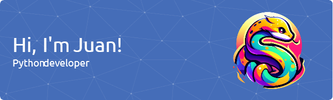

### Hi there 👋

## Hi, i'm Juan Duque 
    
 
 
- 🏷 I am currently studying web development. / Actualmente estoy estudiando desarrollo web.
- 🌱 I’m learning Python. / Estoy aprendiendo Python.                            
<!-- - 🤔 I’m looking for help with ... -->
- 💬 Ask me about anything you want to know about me. / Pregúntame todo lo que quieras saber sobre mí.
- 📫 How to reach me: ? 
- 😄 Pronoun: he /  Pronombre: él
- ⚡ Fun fact: In Cartagena de Indias the sea lights up /  Dato curioso: En Cartagena de Indias el mar se ilumina

## My Skill Set  
<table><tr><td valign="top" width="33%">

  
  
  
  
  
  

</td></tr></table>  

   

## Connect with me  

  

  
  

   

## Github Stats  

  

  

   

## Recent Blog Posts  
- [Como hacer un generador de contraseñas](https://dev.to/juan_duque/como-hacer-un-generador-ed-contrasenas-con-python-og2)

- [Como animar un corazón con keyframes (Básico)](https://dev.to/juan_duque/como-animar-un-corazon-con-keyframes-basico-fbe)
