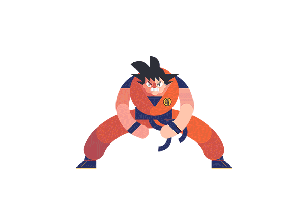

<h1 style="color:aquamarine"> Hi there! 

</h1>

I'm Juan Duque, a passionate Python Developer from Colombia, with experience in Django. I enjoy creating efficient
and scalable applications and currently exploring Mandarin and English. Let's build something
amazing together!
<h2 style="color:aquamarine">About Me

</h2>

I am a Python-focused developer, constantly honing my skills while learning new languages such as 🇨🇳 Mandarin and 🇺🇸 English. My career in the tech world is just starting, but it has already been exciting and I am always up for new challenges. 💚💙❤️💛💜

<h2 style="color:aquamarine">Connect with Me</h2>

[GitHub](https://github.com/boudgnosis)  |  [Linktree](https://linktr.ee/Boudgnosis) | [CodePen](https://codepen.io/boudgnosis) | [dev.to](https://dev.to/juan_duque) | [Linkedin](https://www.linkedin.com/in/jpariasduque/)|  🤝  Let's collaborate!

<h2 style="color:aquamarine">Skills & Technologies</h2>
<divstyle="display: flex; justify-content: center; align-items: center; gap: 10px;">

 

📂 Additional technologies

 

Documentation and data tools

My terminal

My operating system

<h2 style="color:aquamarine">GitHub Stats</h2>

 
 

<h2 style="color:aquamarine">Recent Blog Posts</h2>

- [Como hacer un generador de contraseñas](https://dev.to/juan_duque/como-hacer-un-generador-ed-contrasenas-con-python-og2)

- [Como animar un corazón con keyframes (Básico)](https://dev.to/juan_duque/como-animar-un-corazon-con-keyframes-basico-fbe)

<h2 style="color:aquamarine">Certifications
</h2>

- [Introduction to back-end development](https://www.coursera.org/account/accomplishments/records/VCMXKA01N2NC) - Meta, 2024
- [Programming in Python](https://www.coursera.org/account/accomplishments/records/9GZYIR14NKQK) - Meta, 2024

<h3 style="color:SlateGray;">Badges</h3>

